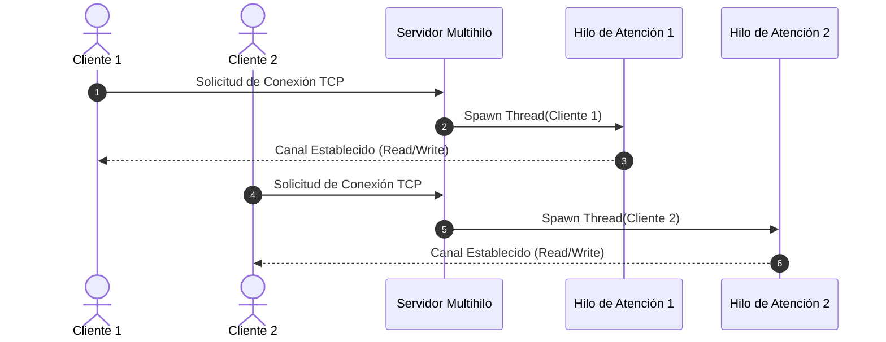
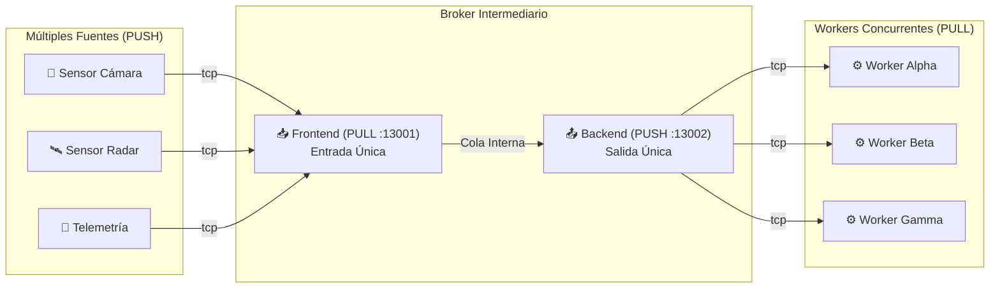

<div align="center">

# 🌐 Sistemas Distribuidos (Distributed Systems)
### *Laboratorios, Workshops y Proyectos Prácticos*

[](https://www.python.org/)
[](https://en.wikipedia.org/wiki/C_(programming_language))
[](https://zeromq.org/)
[](#)
[](#)

<p align="center">
  <b>Colección de talleres prácticos e implementaciones de patrones arquitectónicos, comunicación por paso de mensajes, concurrencia, RPC/RMI y procesamiento distribuido.</b>
</p>

[📚 Descripción](#-descripción-del-repositorio) •
[📁 Estructura](#-estructura-del-proyecto) •
[🛠️ Workshops](#%EF%B8%8F-workshops-y-talleres) •
[🚀 Guía de Inicio](#-guía-de-inicio-rápido) •
[📊 Comparativa](#-comparativa-de-patrones) •
[👥 Créditos](#-créditos)

---

</div>

## 📖 Descripción del Repositorio

Este repositorio contiene los desarrollos, códigos fuente, experimentos y reportes técnicos de la asignatura **Sistemas Distribuidos**. El objetivo central es explorar y dominar los mecanismos fundamentales de interconexión, concurrencia, sincronización y distribución de carga en arquitecturas cliente-servidor, entre pares (*peer-to-peer*) y orientadas a mensajes.

---

## 📁 Estructura del Proyecto

```tree
📦 Sistemas-Distribuidos
 ┣ 📂 Workshop 1/                       # Fundamentos de Sockets y Multithreading
 ┃ ┣ 📜 client-socket.py               # Cliente TCP básico en Python
 ┃ ┣ 📜 server-socket.py               # Servidor TCP monohilo en Python
 ┃ ┣ 📜 server-multithreading.py       # Servidor TCP multihilo en Python
 ┃ ┣ 📜 client-random.py               # Cliente generador de carga aleatoria (Python)
 ┃ ┣ 📜 client.c                       # Cliente de sockets en lenguaje C
 ┃ ┣ 📜 server-multithreading.c        # Servidor concurrente en C con POSIX Threads (pthreads)
 ┃ ┗ 📜 client-random.c                # Cliente en C con envío de mensajes aleatorios
 ┣ 📂 Workshop2/                        # Comunicación, Middleware y Patrones de Mensajería
 ┃ ┣ 📂 RMI/                            # Plantillas y bases de Invocación Remota (RMI/RPC)
 ┃ ┣ 📂 Publisher-Subscriber/           # Plantillas base del patrón PUB-SUB en ZeroMQ
 ┃ ┣ 📂 Pipeline/                       # Plantillas base de flujos Source-Worker
 ┃ ┣ 📂 Solucion_Workshop2/             # ✨ Solución integral y robusta del Workshop 2
 ┃ ┃ ┣ 📂 Parte1_RMI_MatrixManager/    # Gestor matricial distribuido (XML-RPC + NumPy)
 ┃ ┃ ┣ 📂 Parte2_Publisher_Subscriber/ # Multi-Publisher & Multi-Subscriber ZeroMQ
 ┃ ┃ ┣ 📂 Parte3_Pipeline_Broker/      # Pipeline Source -> Broker -> Worker con ZeroMQ
 ┃ ┃ ┣ 📜 test_solutions.py            # Suite de pruebas automatizadas y benchmarking
 ┃ ┃ ┗ 📜 INFORME_WORKSHOP2.md         # Informe técnico detallado con resultados
 ┃ ┗ 📜 workshop2-description.pdf      # Guía oficial del taller
 ┗ 📜 README.md                         # Documentación principal
```

---

## 🛠️ Workshops y Talleres

### 🔹 [Workshop 1: Sockets TCP y Multithreading](file:///Workshop%201)
Implementación de canales de comunicación a nivel de transporte mediante Sockets TCP/IP estándar en **C** y **Python**. Se abordan los paradigmas de concurrencia y el impacto del bloqueo de I/O:

* **Sockets Bloqueantes vs No Bloqueantes:** Análisis del ciclo de vida `socket()`, `bind()`, `listen()`, `accept()`.
* **Servidores Concurrentes:** Creación dinámica de hilos de ejecución (*threads*) para atender múltiples clientes simultáneamente sin degradación de servicio.
* **Compatibilidad Multiplataforma:** Interoperabilidad entre clientes en C (`sys/socket.h`, `pthread.h`) y servidores en Python (`socket`, `threading`).



---

### 🔹 [Workshop 2: Middleware y Patrones de Mensajería](file:///Workshop2)
Estudio profundo de abstracciones de comunicación de alto nivel y arquitecturas desacopladas empleando **ZeroMQ** y **XML-RPC**:

#### 1️⃣ Parte 1: Invocación de Métodos Remotos (RMI / RPC)
* **Caso de Uso:** *Distributed Matrix Manager* con aceleración numérica en **NumPy**.
* **Concepto:** Ejecución transparente de operaciones complejas ($A + B$, $A - B$, $A \times B$, $A^T$, $\det(A)$) en nodos de cómputo remoto.

#### 2️⃣ Parte 2: Patrón Publicador-Suscriptor (PUB-SUB)
* **Arquitectura:** Múltiples publicadores independientes emitiendo eventos heterogéneos (Clima, Finanzas, Deportes).
* **Filtrado Eficiente:** Suscriptores multi-canal conectados a múltiples endpoints con filtrado selectivo por tópicos en tiempo real.

#### 3️⃣ Parte 3: Patrón Pipeline con Broker Intermediario
* **Topología:** $N$ Fuentes (*PUSH*) $\longrightarrow$ **Broker Intermediario** (*PULL / PUSH*) $\longrightarrow$ $M$ Trabajadores (*PULL*).
* **Desacoplamiento:** El broker consolida la recepción mediante una entrada única y distribuye tareas equilibradamente (*Fair Queueing / Round Robin*) evitando la sobrecarga de trabajadores individuales.



---

## 📊 Comparativa de Patrones

| Patrón / Mecanismo | Paradigma | Acoplamiento | Sincronía | Caso de Uso Óptimo |
| :--- | :--- | :--- | :--- | :--- |
| **Sockets TCP** | Punto a Punto | Fuerte (IP/Puerto directo) | Síncrono / I/O Bloqueante | Comunicación básica de bajo nivel, protocolos binarios custom. |
| **RMI / XML-RPC** | Request-Reply | Fuerte (Interfaz compartida) | Síncrono | Cómputo matemático intensivo, servicios RPC, APIs internas. |
| **PUB-SUB (ZeroMQ)** | 1-a-N / N-a-M | Muy Débil (Por tópicos) | Asíncrono | Notificaciones en tiempo real, feeds bursátiles, telemetría IoT. |
| **Pipeline con Broker** | Flujo de Tareas | Débil (Vía Broker) | Asíncrono | Procesamiento paralelo de lotes, balanceo dinámico de carga. |

---

## 🚀 Guía de Inicio Rápido

### 1. Prerrequisitos
Asegúrate de contar con Python 3.9+ y un compilador de C (GCC o Clang). Instala las dependencias necesarias:

```bash
pip install pyzmq numpy
```

### 2. Ejecutar Workshop 1 (Sockets TCP)
```bash
# Terminal 1: Iniciar Servidor Multihilo
python "Workshop 1/server-multithreading.py"

# Terminal 2: Iniciar Cliente Interactivo
python "Workshop 1/client-socket.py"
```

### 3. Ejecutar Pruebas Automatizadas del Workshop 2
Dentro de la carpeta de soluciones, se incluye un banco de pruebas que valida concurrentemente los 3 componentes:

```bash
cd "Workshop2/Solucion_Workshop2"
python test_solutions.py
```

---

## 💻 Tecnologías y Herramientas


---

## 👥 Créditos

- **Materia:** Sistemas Distribuidos
- **Institución:** Universidad Yachay Tech - School of Mathematical and Computational Sciences
- **Docente:** Prof. Francisco Hidrobo

<div align="center">
  <sub>Desarrollado con fines académicos y de investigación en computación distribuida.</sub>
</div>
