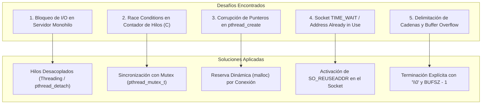
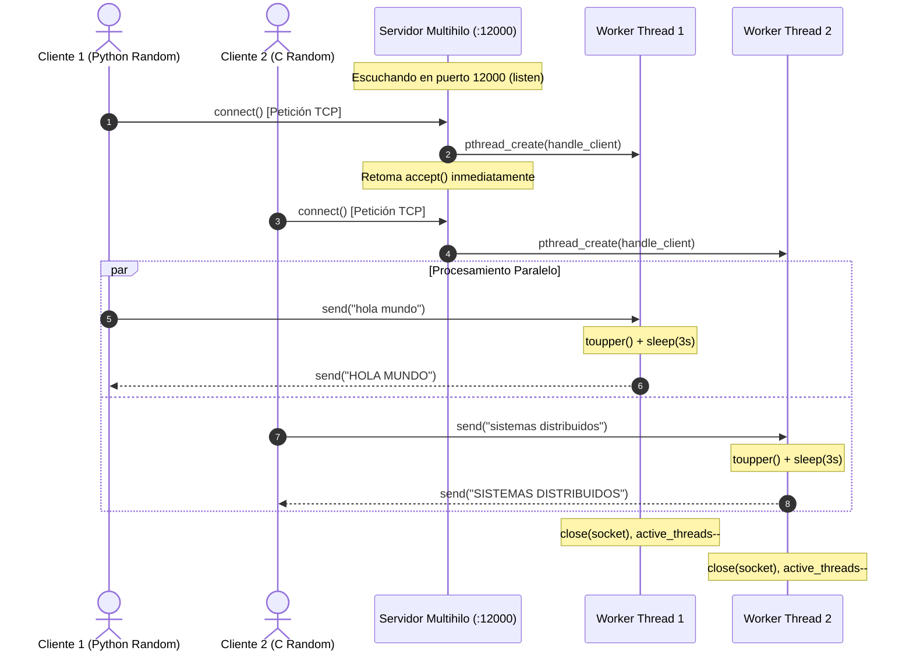

<div align="center">

# 🧵 Workshop 1: Sockets TCP y Concurrencia Multihilo
### *Sistemas Distribuidos — Fundamentos de Comunicación a Nivel de Transporte*

[](https://en.wikipedia.org/wiki/C_(programming_language))
[](https://www.python.org/)
[](#)
[](#)

<p align="center">
  <b>Diseño, implementación y resolución de desafíos en servidores concurrentes y clientes aleatorios utilizando Sockets de Berkeley en C y Sockets de Alto Nivel en Python.</b>
</p>

</div>

---

## 🎯 Objetivos del Workshop

1. Comprender el ciclo de vida de los sockets orientados a conexión TCP (`socket`, `bind`, `listen`, `accept`, `connect`, `send`, `recv`, `close`).
2. Resolver el cuello de botella de los **servidores iterativos (monohilo)** mediante **servidores concurrentes multihilo**.
3. Implementar generadores de carga aleatoria para evaluar la capacidad de respuesta bajo estrés y concurrencia.
4. Garantizar la interoperabilidad cruzada entre implementaciones en **C** (bajo nivel) y **Python** (alto nivel).

---

## 📂 Archivos del Taller

| Archivo | Lenguaje | Rol / Descripción |
| :--- | :---: | :--- |
| [`server-socket.py`](file:///c:/Users/User/Desktop/Sistemas-Distribuidos/Sistemas-Distribuidos/Workshop%201/server-socket.py) | Python | Servidor iterativo monohilo básico (bloqueante). |
| [`server-multithreading.py`](file:///c:/Users/User/Desktop/Sistemas-Distribuidos/Sistemas-Distribuidos/Workshop%201/server-multithreading.py) | Python | Servidor concurrente que crea un hilo (`threading.Thread`) por cada cliente. |
| [`client-socket.py`](file:///c:/Users/User/Desktop/Sistemas-Distribuidos/Sistemas-Distribuidos/Workshop%201/client-socket.py) | Python | Cliente TCP interactivo para envío manual de cadenas de texto. |
| [`client-random.py`](file:///c:/Users/User/Desktop/Sistemas-Distribuidos/Sistemas-Distribuidos/Workshop%201/client-random.py) | Python | Cliente generador de $N$ mensajes aleatorios en bucle con retardos. |
| [`server-multithreading.c`](file:///c:/Users/User/Desktop/Sistemas-Distribuidos/Sistemas-Distribuidos/Workshop%201/server-multithreading.c) | C | Servidor multihilo de alto rendimiento con `pthread` y control de concurrencia. |
| [`client.c`](file:///c:/Users/User/Desktop/Sistemas-Distribuidos/Sistemas-Distribuidos/Workshop%201/client.c) | C | Cliente de sockets en C interactivo con resolución de host/IP. |
| [`client-random.c`](file:///c:/Users/User/Desktop/Sistemas-Distribuidos/Sistemas-Distribuidos/Workshop%201/client-random.c) | C | Cliente generador en C con cadenas aleatorias y resolución DNS (`gethostbyname`). |

---

## 🧩 Desafíos Técnicos y Soluciones Implementadas

Durante el desarrollo de este laboratorio surgieron problemas clásicos de redes y concurrencia. A continuación se detalla cómo fueron diagnosticados y resueltos:



### 1. Bloqueo de I/O en Servidor Monohilo (*Starvation*)
* **Problema:** En `server-socket.py`, cuando un cliente se conectaba y el servidor simulaba una tarea pesada (`time.sleep(3)`), todas las demás solicitudes entrantes quedaban congeladas en la cola de espera del sistema operativo.
* **Solución:** Se implementó una arquitectura de *Hilo por Conexión* (*Thread-per-Connection*).
  - En **Python:** `threading.Thread(target=handle_client, args=(conn, addr)).start()`.
  - En **C:** `pthread_create(&thread, NULL, handle_client, cargs)` junto con `pthread_detach()` para evitar fugas de memoria sin bloquear el bucle principal con `pthread_join()`.

### 2. Condiciones de Carrera (*Race Conditions*) en C
* **Problema:** Múltiples hilos concurrentes incrementaban y decrementaban la variable global `active_threads` al mismo tiempo, generando inconsistencias y lecturas erróneas del número de clientes activos.
* **Solución:** Se implementó una exclusión mutua mediante un cerrojo:
  ```c
  pthread_mutex_lock(&count_mutex);
  active_threads++;
  pthread_mutex_unlock(&count_mutex);
  ```

### 3. Fuga de Memoria y Colisión de Punteros en `pthread_create`
* **Problema:** Pasar la dirección de memoria de una estructura local `&clientAddr` directamente a `pthread_create` causaba que las conexiones subsecuentes sobreescribieran los datos del cliente antes de que el hilo anterior terminara de leerlos.
* **Solución:** Asignación dinámica e independiente en el *heap* para cada cliente aceptado:
  ```c
  client_args *cargs = malloc(sizeof(client_args));
  cargs->connectionSocket = connectionSocket;
  cargs->addr = clientAddr;
  pthread_create(&client_thread, NULL, handle_client, cargs);
  ```
  El hilo libera la memoria (`free(cargs)`) inmediatamente al iniciar su ejecución.

### 4. Error `Address already in use` tras Reinicio
* **Problema:** Al detener y reiniciar rápidamente el servidor, el puerto permanecía en estado `TIME_WAIT` a nivel de kernel, impidiendo el `bind()`.
* **Solución:** Configuración del socket reutilizable antes del bind:
  ```c
  int opt = 1;
  setsockopt(serverSocket, SOL_SOCKET, SO_REUSEADDR, &opt, sizeof(opt));
  ```

### 5. Delimitación de Cadenas en C y Desbordamientos
* **Problema:** Los buffers leídos vía `recv()` no contienen automáticamente el carácter terminador `\0`, lo cual provocaba lecturas de memoria basura al imprimir con `printf("%s")`.
* **Solución:** Se reservó un byte de holgura en la lectura (`recv(sock, buf, BUFSZ - 1, 0)`) y se insertó el terminador explícito:
  ```c
  buf[n] = '\0';
  ```

---

## 🔄 Flujo de Comunicación Concurrente



---

## 🚀 Guía de Compilación y Ejecución

### 1. Ejecución con Python

```bash
# 1. Iniciar el servidor multihilo
python server-multithreading.py

# 2. En otra terminal, lanzar el cliente interactivo
python client-socket.py

# 3. En una tercera terminal, lanzar el cliente aleatorio
python client-random.py
```

### 2. Compilación y Ejecución en C (Linux / WSL / MinGW)

```bash
# Compilar servidor multihilo con soporte de pthreads
gcc server-multithreading.c -o server-multithreading -lpthread

# Compilar cliente interactivo
gcc client.c -o client

# Compilar cliente aleatorio
gcc client-random.c -o client-random

# Ejecución
./server-multithreading
./client
./client-random
```

### 3. Prueba de Interoperabilidad Cruzada
Es posible combinar clientes y servidores de distintos lenguajes sin ninguna incompatibilidad:
* **Servidor C (`./server-multithreading`)** $\longleftrightarrow$ **Cliente Python (`client-random.py`)**
* **Servidor Python (`server-multithreading.py`)** $\longleftrightarrow$ **Cliente C (`./client-random`)**

---

## 📈 Conclusiones del Workshop 1

1. **Escalabilidad:** El paso de un modelo iterativo a uno multihilo redujo el tiempo de espera acumulado de $O(N \times t_{proc})$ a $O(t_{proc})$ para peticiones concurrentes.
2. **Independencia del Lenguaje:** La adhesión rigurosa al estándar de sockets TCP permitió una comunicación transparente entre código de bajo nivel en C y alto nivel en Python.
3. **Gestión de Recursos:** La liberación oportuna de descriptores de sockets (`close`) y memoria dinámica (`free`) es crítica para evitar fugas de recursos en servicios de larga duración.
