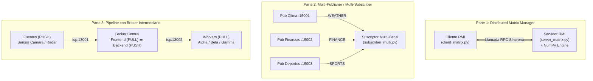

<div align="center">

# ⚡ Workshop 2: Middleware y Patrones de Mensajería
### *Sistemas Distribuidos — RMI/RPC, ZeroMQ Pub-Sub y Pipeline con Broker*

[](https://www.python.org/)
[](https://zeromq.org/)
[](https://numpy.org/)
[](#)

<p align="center">
  <b>Diseño, implementación y resolución de problemas en tres modelos avanzados de comunicación distribuida: Invocación de Métodos Remotos (RMI), Publicación-Suscripción (PUB-SUB) y Procesamiento en Pipeline con Broker intermediario.</b>
</p>

[📐 Arquitectura General](#-arquitectura-y-partes-del-taller) •
[🧩 Problemas y Soluciones](#-desafíos-técnicos-y-cómo-los-resolvimos) •
[📂 Estructura](#-estructura-de-archivos) •
[🚀 Guía de Ejecución](#-guía-de-ejecución) •
[📊 Suite de Pruebas](#-suite-de-pruebas-automatizadas) •
[📑 Informe Técnico](#-informe-completo)

---

</div>

## 📐 Arquitectura y Partes del Taller

El Workshop 2 se divide en tres componentes independientes de alta cohesión y bajo acoplamiento:



---

## 🧩 Desafíos Técnicos y Cómo los Resolvimos

A continuación se documentan los problemas críticos encontrados durante la construcción de la solución y las estrategias implementadas para resolverlos:

---

### 1️⃣ Parte 1 (RMI / XML-RPC): Serialización de Matrices y Validación de Dimensiones

* **Problema Encontrado:**
  1. El protocolo estándar XML-RPC no soporta tipos de datos nativos como los arreglos `numpy.ndarray`. Intentar serializarlos genera errores de tipo `TypeError: cannot serialize <class 'numpy.ndarray'>`.
  2. Si un cliente solicita una multiplicación matricial $A \times B$ con dimensiones incompatibles (ejemplo: $2\times 3$ con $2\times 3$), el servidor lanzaba excepciones no controladas colapsando la conexión.
* **Solución Implementada:**
  - **Serialización Limpia:** El servidor convierte automáticamente las matrices recibidas a `np.array(..., dtype=float)` para el cómputo vectorial acelerado, y antes de responder convierte el resultado mediante `.tolist()` dentro de un diccionario estructurado:
    ```python
    return {
        "status": "OK",
        "operation": "prod",
        "result": result.tolist(),
        "shape": list(result.shape)
    }
    ```
  - **Manejo Robusto de Errores:** Se capturan inconsistencias algebraicas mediante bloques `try/except ValueError` retornando mensajes de error explicativos sin interrumpir el servicio.

---

### 2️⃣ Parte 2 (ZeroMQ PUB-SUB): El Síndrome del "Slow Joiner" y Multi-Conexión

* **Problema Encontrado:**
  1. **Pérdida de primeros mensajes (*Slow Joiner Syndrome*):** En ZeroMQ, el handshake TCP de los sockets `SUB` se realiza en segundo plano de manera asíncrona. Si el publicador emite mensajes inmediatamente al iniciar, los primeros mensajes se pierden antes de que el suscriptor termine de negociar el canal.
  2. **Escucha simultánea:** El requerimiento exigía que un suscriptor reciba mensajes de múltiples publicadores independientes sin crear un hilo bloqueante por cada puerto.
* **Solución Implementada:**
  - **Sincronización:** Se incorporó un retardo de estabilización inicial (`time.sleep(0.3)`) en los publicadores y una numeración secuencial con timestamp en cada mensaje para verificar la integridad del flujo.
  - **Multi-Endpoint Connect:** Se aprovechó la capacidad nativa de ZeroMQ donde un único socket `zmq.SUB` puede ejecutar `.connect()` a múltiples URLs y agregar múltiples filtros por prefijo:
    ```python
    sub_socket = context.socket(zmq.SUB)
    for ep in args.endpoints:
        sub_socket.connect(ep)
    for topic in args.topics:
        sub_socket.setsockopt_string(zmq.SUBSCRIBE, "" if topic == "ALL" else topic)
    ```

---

### 3️⃣ Parte 3 (Pipeline Broker): Balanceo de Carga Multi-Fuente a Multi-Worker

* **Problema Encontrado:**
  1. Un flujo directo *Source $\to$ Worker* en ZeroMQ (PUSH $\to$ PULL) funciona adecuadamente para una sola fuente. Sin embargo, con **múltiples fuentes concurrentes** y **múltiples trabajadores**, conectar cada fuente con cada trabajador generaba una malla compleja ($N \times M$ conexiones), acoplamiento rígido de puertos y falta de balanceo centralizado.
* **Solución Implementada:**
  - **Broker Intermediario con Entrada/Salida Únicas:**
    - **Frontend (PULL en puerto `13001`):** Punto único que recibe de forma no bloqueante las tareas de cualquier número de *Sources*.
    - **Backend (PUSH en puerto `13002`):** Punto único que distribuye las tareas hacia los *Workers* disponibles aplicando *Fair Queueing* (Round-Robin inteligente).
    ```python
    # Bucle nuclear del Broker
    while True:
        task_data = frontend.recv()
        backend.send(task_data)
    ```
  - **Desacoplamiento Total:** Las fuentes solo necesitan conocer el puerto `13001`, y los trabajadores solo el puerto `13002`. Se pueden agregar o remover fuentes y trabajadores dinámicamente sin reiniciar el broker.

---

### 4️⃣ Automatización y Orquestación: `test_solutions.py`

* **Problema Encontrado:**
  - Probar manualmente los tres escenarios requería abrir hasta **9 ventanas de terminal simultáneas** y coordinar los tiempos de inicio y apagado.
* **Solución Implementada:**
  - Se construyó un script orquestador [`test_solutions.py`](file:///c:/Users/User/Desktop/Sistemas-Distribuidos/Sistemas-Distribuidos/Workshop2/Solucion_Workshop2/test_solutions.py) que:
    1. Lanza los procesos en segundo plano usando `subprocess.Popen`.
    2. Captura los flujos `stdout` de cada nodo en tiempo real con hilos dedicados.
    3. Evalúa aserciones y condiciones de éxito automáticamente.
    4. Envía señales `SIGINT`/`SIGTERM` y limpia los puertos garantizando que ningún socket quede colgado.

---

## 📂 Estructura de Archivos

```tree
📦 Workshop2
 ┣ 📂 Solucion_Workshop2/             # ✨ Solución completa y verificada
 ┃ ┣ 📂 Parte1_RMI_MatrixManager/
 ┃ ┃ ┣ 📜 server_matrix.py            # Servidor XML-RPC con NumPy
 ┃ ┃ ┣ 📜 client_matrix.py            # Cliente interactivo y modo --demo
 ┃ ┃ ┗ 📜 README.md                   # Guía de ejecución de la Parte 1
 ┃ ┣ 📂 Parte2_Publisher_Subscriber/
 ┃ ┃ ┣ 📜 pub_weather.py              # Publicador de Clima (:15001)
 ┃ ┃ ┣ 📜 pub_finance.py              # Publicador Financiero (:15002)
 ┃ ┃ ┣ 📜 pub_sports.py               # Publicador de Deportes (:15003)
 ┃ ┃ ┣ 📜 publisher_service.py        # Publicador genérico parametrizable
 ┃ ┃ ┣ 📜 subscriber_multi.py         # Suscriptor multi-canal con filtrado
 ┃ ┃ ┗ 📜 README.md                   # Guía de ejecución de la Parte 2
 ┃ ┣ 📂 Parte3_Pipeline_Broker/
 ┃ ┃ ┣ 📜 broker.py                   # Broker central (PULL :13001 ➡️ PUSH :13002)
 ┃ ┃ ┣ 📜 source_pipeline.py          # Generador de tareas (PUSH)
 ┃ ┃ ┣ 📜 worker_pipeline.py          # Trabajador consumidor (PULL)
 ┃ ┃ ┗ 📜 README.md                   # Guía de ejecución de la Parte 3
 ┃ ┣ 📜 test_solutions.py             # Orquestador y banco de pruebas integral
 ┃ ┗ 📜 INFORME_WORKSHOP2.md          # Informe técnico exhaustivo
 ┣ 📂 RMI/                            # Plantillas originales de referencia
 ┣ 📂 Publisher-Subscriber/           # Plantillas originales de referencia
 ┣ 📂 Pipeline/                       # Plantillas originales de referencia
 ┗ 📜 workshop2-description.pdf       # Guía de especificaciones del taller
```

---

## 🚀 Guía de Ejecución

### Requisitos Previos
```bash
pip install pyzmq numpy
```

### Opción A: Ejecución Automatizada (Recomendada)
Ejecuta la suite que prueba y valida todas las partes de forma desatendida:
```bash
cd "Workshop2/Solucion_Workshop2"
python test_solutions.py
```

---

### Opción B: Ejecución Manual Paso a Paso

#### 🔹 1. Parte 1 (Matrix Manager RMI)
```bash
# Terminal 1: Servidor
python "Workshop2/Solucion_Workshop2/Parte1_RMI_MatrixManager/server_matrix.py"

# Terminal 2: Cliente en modo demostración automática
python "Workshop2/Solucion_Workshop2/Parte1_RMI_MatrixManager/client_matrix.py" --demo
```

#### 🔹 2. Parte 2 (ZeroMQ Pub-Sub)
```bash
# Terminales 1, 2 y 3: Publicadores
python "Workshop2/Solucion_Workshop2/Parte2_Publisher_Subscriber/pub_weather.py"
python "Workshop2/Solucion_Workshop2/Parte2_Publisher_Subscriber/pub_finance.py"
python "Workshop2/Solucion_Workshop2/Parte2_Publisher_Subscriber/pub_sports.py"

# Terminal 4: Suscriptor interesado en Clima y Deportes
python "Workshop2/Solucion_Workshop2/Parte2_Publisher_Subscriber/subscriber_multi.py" \
  --name "Sub-Clima-Deportes" \
  --endpoints tcp://localhost:15001 tcp://localhost:15003 \
  --topics WEATHER SPORTS
```

#### 🔹 3. Parte 3 (Pipeline con Broker)
```bash
# Terminal 1: Broker Central
python "Workshop2/Solucion_Workshop2/Parte3_Pipeline_Broker/broker.py"

# Terminales 2 y 3: Trabajadores Concurrentes
python "Workshop2/Solucion_Workshop2/Parte3_Pipeline_Broker/worker_pipeline.py" --id "Worker-1"
python "Workshop2/Solucion_Workshop2/Parte3_Pipeline_Broker/worker_pipeline.py" --id "Worker-2"

# Terminal 4: Fuente generadora de tareas
python "Workshop2/Solucion_Workshop2/Parte3_Pipeline_Broker/source_pipeline.py" --id "Sensor-Camara" --tasks 10
```

---

## 📊 Matriz Comparativa de Patrones

| Criterio | RMI / XML-RPC | ZeroMQ PUB-SUB | ZeroMQ Pipeline con Broker |
| :--- | :--- | :--- | :--- |
| **Topología** | 1 a 1 (Cliente-Servidor) | 1 a N / N a M | N a 1 (Broker) a M |
| **Sincronismo** | Síncrono (Bloquea hasta respuesta) | Asíncrono (Fire-and-forget) | Asíncrono (Distribución de flujo) |
| **Acoplamiento Espacial** | Fuerte (Requiere IP y método) | Débil (Solo requiere tópico) | Débil (Puntos de anclaje fijos en Broker) |
| **Garantía de Entrega** | Confirmada por respuesta | No garantizada si no hay suscriptor | Garantizada en buffer de cola |
| **Uso Ideal** | Invocación de funciones remotas | Transmisión masiva de eventos | Procesamiento distribuido de tareas |

---

## 📑 Informe Completo

Para consultar el análisis formal, tiempos de respuesta, fórmulas matemáticas y capturas de ejecución completas, consulta el [Informe Técnico Oficial](file:///c:/Users/User/Desktop/Sistemas-Distribuidos/Sistemas-Distribuidos/Workshop2/Solucion_Workshop2/INFORME_WORKSHOP2.md).
