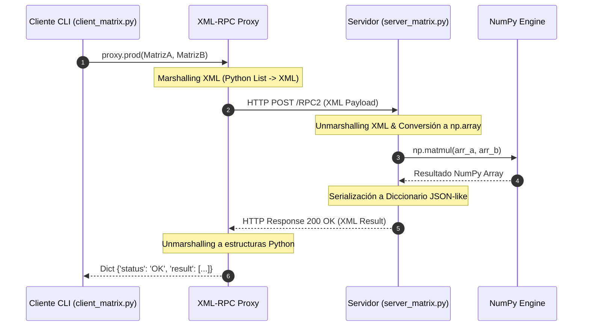

# Taller 2: Comunicación y Patrones de Interacción en Sistemas Distribuidos (Workshop 2)

**Universidad Yachay Tech**  
**Escuela de Ciencias Matemáticas y Computacionales**  
**Asignatura:** Sistemas Distribuidos  
**Docente:** Francisco Hidrobo, Ph.D.  
**Fecha:** Septiembre 2026  
**Autores:** Dario Pomasqui & Adriana Sofia Espinoza Chicaiza  
**Repositorio GitHub:** [adrianasofiaespinoza/Sistemas-Distribuidos/Workshop2](https://github.com/adrianasofiaespinoza/Sistemas-Distribuidos/tree/main/Workshop2)

---

## 📋 Descripción General

Este taller práctico aborda el estudio, diseño e implementación de tres paradigmas fundamentales de **Comunicación en Sistemas Distribuidos**:

1. **Invocación de Métodos Remotos (RMI / RPC):** Comunicación sincrónica orientada a objetos/servicios mediante protocolos estándar (XML-RPC sobre HTTP/TCP) con procesamiento vectorial de alto rendimiento (`NumPy`).
2. **Patrón Publicador-Suscriptor (Pub-Sub N-a-N):** Comunicación orientada a eventos con desacoplamiento en tiempo y espacio utilizando sockets `zmq.PUB` / `zmq.SUB` de ZeroMQ con filtrado por tópicos.
3. **Patrón Pipeline Distribuido con Broker Intermediario:** Modelo de ventilación y distribución de carga de trabajo (*Work Distribution*) asíncrono utilizando patrones `PUSH` / `PULL` de ZeroMQ y serialización de objetos (`pickle`).

---

## 📁 Estructura del Repositorio

```text
Workshop2/
└── Solucion_Workshop2/
    ├── Parte1_RMI_MatrixManager/
    │   ├── server_matrix.py       # Servidor RMI (XML-RPC) para operaciones matriciales avanzadas con NumPy
    │   └── client_matrix.py       # Cliente interactivo CLI RMI (modos manual, aleatorio y quick demo)
    ├── Parte2_Publisher_Subscriber/
    │   ├── publisher_service.py   # Publisher genérico de servicios configurables por CLI
    │   ├── pub_weather.py         # Publisher especializado en el tópico CLIMA (WEATHER)
    │   ├── pub_finance.py         # Publisher especializado en el tópico FINANZAS (FINANCE)
    │   ├── pub_sports.py          # Publisher especializado en el tópico DEPORTES (SPORTS)
    │   └── subscriber_multi.py    # Suscriptor multi-servidor y multi-tópico parametrizable
    └── Parte3_Pipeline_Broker/
        ├── broker.py              # Broker intermediario central (Frontend PULL <-> Backend PUSH)
        ├── source_pipeline.py     # Fuente generadora de tareas distribuidas (PUSH)
        └── worker_pipeline.py     # Trabajador / Consumidor asíncrono de tareas (PULL)
```

---

## 🛠️ Explicación Detallada de las 3 Actividades

---

### 🔹 Parte 1: Invocación Remota de Métodos (RMI) - Distributed Matrix Manager (`Parte1_RMI_MatrixManager/`)

#### 🎯 Objetivo
Implementar un servicio distribuido de cómputo matricial remoto aplicando el paradigma **RMI (Remote Method Invocation)** sobre **XML-RPC**, permitiendo a clientes remotos ejecutar operaciones algebraicas complejas como si se tratara de llamadas a métodos locales.

#### 🏗️ Arquitectura y Componentes
* **[`server_matrix.py`](file:///c:/Users/User/Desktop/8vo/Sistemas-Distribuidos/Sistemas-Distribuidos/Workshop2/Solucion_Workshop2/Parte1_RMI_MatrixManager/server_matrix.py):**
  * Servidor basado en `SimpleXMLRPCServer` que expone la clase `MatrixManager`.
  * Utiliza `NumPy` para ejecutar cálculos optimizados en C/C++.
  * Operaciones remotas expuestas:
    * `add(A, B)`: Suma matricial $A + B$.
    * `sub(A, B)`: Resta matricial $A - B$.
    * `prod(A, B)`: Producto matricial $A \cdot B$ (`np.matmul`).
    * `transpose(A)`: Transpuesta de matriz $A^T$.
    * `det(A)`: Determinante de matriz cuadrada $\det(A)$ (`np.linalg.det`).
  * Endpoint por defecto: `http://0.0.0.0:12000/RPC2`.
* **[`client_matrix.py`](file:///c:/Users/User/Desktop/8vo/Sistemas-Distribuidos/Sistemas-Distribuidos/Workshop2/Solucion_Workshop2/Parte1_RMI_MatrixManager/client_matrix.py):**
  * Cliente que se conecta al servidor mediante `xmlrpc.client.ServerProxy`.
  * Ofrece menú interactivo para ingresar matrices manualmente, generarlas aleatoriamente o ejecutar una prueba automática completa (`--demo`).



#### 💡 Conceptos Clave de Sistemas Distribuidos
* **Marshalling / Unmarshalling:** Transformación de objetos locales (listas de Python y arrays NumPy) en mensajes XML estandarizados para transmisión por HTTP y su posterior reconstrucción en el receptor.
* **Transparencia de Localización:** El cliente invoca `proxy.add(a, b)` como si fuera un método local sin manipular sockets TCP directamente.

---

### 🔹 Parte 2: Patrón Publicador-Suscriptor N-a-N con ZeroMQ (`Parte2_Publisher_Subscriber/`)

#### 🎯 Objetivo
Diseñar una arquitectura de comunicación orientada a eventos desacoplada en espacio y tiempo, permitiendo a múltiples publicadores independientes emitir información en tiempo real a múltiples suscriptores según sus tópicos de interés.

#### 🏗️ Arquitectura y Componentes
* **Publishers Específicos ([`pub_weather.py`](file:///c:/Users/User/Desktop/8vo/Sistemas-Distribuidos/Sistemas-Distribuidos/Workshop2/Solucion_Workshop2/Parte2_Publisher_Subscriber/pub_weather.py), [`pub_finance.py`](file:///c:/Users/User/Desktop/8vo/Sistemas-Distribuidos/Sistemas-Distribuidos/Workshop2/Solucion_Workshop2/Parte2_Publisher_Subscriber/pub_finance.py), [`pub_sports.py`](file:///c:/Users/User/Desktop/8vo/Sistemas-Distribuidos/Sistemas-Distribuidos/Workshop2/Solucion_Workshop2/Parte2_Publisher_Subscriber/pub_sports.py)):**
  * Sockets de tipo `zmq.PUB`.
  * Emiten flujos continuos de datos periódicos estructurados como `TOPICO [TIMESTAMP] PAYLOAD`.
  * Puertos dedicados: `15001` (Weather), `15002` (Finance), `15003` (Sports).
* **Publisher Genérico ([`publisher_service.py`](file:///c:/Users/User/Desktop/8vo/Sistemas-Distribuidos/Sistemas-Distribuidos/Workshop2/Solucion_Workshop2/Parte2_Publisher_Subscriber/publisher_service.py)):**
  * Permite lanzar dinamícamente cualquier tipo de servicio configurando `--service`, `--port` e `--interval`.
* **Suscriptor Multi-Servicio ([`subscriber_multi.py`](file:///c:/Users/User/Desktop/8vo/Sistemas-Distribuidos/Sistemas-Distribuidos/Workshop2/Solucion_Workshop2/Parte2_Publisher_Subscriber/subscriber_multi.py)):**
  * Socket de tipo `zmq.SUB`.
  * Realiza conexiones múltiples mediante `.connect()` a varios endpoints concurrentemente.
  * Aplica filtros de suscripción específicos (`zmq.SUBSCRIBE`) o globales (`ALL`).

```mermaid
graph TD
    subgraph Publicadores (Publishers)
        P1["pub_weather.py<br/>(Puerto 15001)"] -- "WEATHER ..." --> SUB1
        P2["pub_finance.py<br/>(Puerto 15002)"] -- "FINANCE ..." --> SUB1
        P3["pub_sports.py<br/>(Puerto 15003)"]  -- "SPORTS ..." --> SUB2
    end

    subgraph Suscriptores (Subscribers)
        SUB1["subscriber_multi.py (Cliente 1)<br/>Filtro: [WEATHER, FINANCE]"]
        SUB2["subscriber_multi.py (Cliente 2)<br/>Filtro: [SPORTS]"]
        SUB3["subscriber_multi.py (Cliente 3)<br/>Filtro: [ALL]"]
    end

    P1 -- "WEATHER ..." --> SUB3
    P2 -- "FINANCE ..." --> SUB3
    P3 -- "SPORTS ..." --> SUB3
```

#### 💡 Conceptos Clave de Sistemas Distribuidos
* **Desacoplamiento Espacial:** Los publicadores desconocen quiénes o cuántos suscriptores están escuchando.
* **Desacoplamiento Temporal:** Publicadores y suscriptores no requieren iniciar en un orden estricto ni sincronizar ciclos de reloj.
* **Filtrado en el Lado del Suscriptor:** El socket `zmq.SUB` de ZeroMQ descarta a nivel de transporte los mensajes cuyo prefijo no coincida con sus filtros activos, optimizando la CPU del proceso.

---

### 🔹 Parte 3: Patrón Pipeline Distribuido con Broker Intermediario (`Parte3_Pipeline_Broker/`)

#### 🎯 Objetivo
Implementar un sistema de distribución y balanceo de carga de trabajo (*Work Distribution / Task Ventilator*) asíncrono y altamente escalable utilizando un Broker intermediario con sockets ZeroMQ `PUSH` / `PULL`.

#### 🏗️ Arquitectura y Componentes
* **[`broker.py`](file:///c:/Users/User/Desktop/8vo/Sistemas-Distribuidos/Sistemas-Distribuidos/Workshop2/Solucion_Workshop2/Parte3_Pipeline_Broker/broker.py):**
  * Nodo intermediario que desacopla $M$ Fuentes (*Sources*) de $N$ Trabajadores (*Workers*).
  * **Frontend (`zmq.PULL` en puerto `13001`):** Recibe solicitudes de cualquier fuente generadora de carga.
  * **Backend (`zmq.PUSH` en puerto `13002`):** Redistribuye de manera equitativa (*Round-Robin*) las tareas entre los trabajadores conectados.
* **[`source_pipeline.py`](file:///c:/Users/User/Desktop/8vo/Sistemas-Distribuidos/Sistemas-Distribuidos/Workshop2/Solucion_Workshop2/Parte3_Pipeline_Broker/source_pipeline.py):**
  * Conectado al Frontend del Broker mediante `zmq.PUSH`.
  * Genera tareas con payloads binarios serializados con `pickle` (ID de tarea, carga en ms, timestamp).
* **[`worker_pipeline.py`](file:///c:/Users/User/Desktop/8vo/Sistemas-Distribuidos/Sistemas-Distribuidos/Workshop2/Solucion_Workshop2/Parte3_Pipeline_Broker/worker_pipeline.py):**
  * Conectado al Backend del Broker mediante `zmq.PULL`.
  * Procesa las tareas asignadas simulando cómputo mediante retardos controlados y reporta métricas de rendimiento acumuladas.

```mermaid
flowchart LR
    subgraph Fuentes (Sources)
        S1["Source-1 (PUSH)"]
        S2["Source-2 (PUSH)"]
    end

    subgraph Central Broker
        B_IN["Frontend (PULL)<br/>:13001"]
        B_OUT["Backend (PUSH)<br/>:13002"]
        B_IN ==>|"Pickle Relay"| B_OUT
    end

    subgraph Trabajadores (Workers)
        W1["Worker-1 (PULL)"]
        W2["Worker-2 (PULL)"]
        W3["Worker-3 (PULL)"]
    end

    S1 --> B_IN
    S2 --> B_IN
    B_OUT -->|Round-Robin| W1
    B_OUT -->|Round-Robin| W2
    B_OUT -->|Round-Robin| W3
```

#### 💡 Conceptos Clave de Sistemas Distribuidos
* **Patrón Broker / Intermediario:** Evita la complejidad de conexiones punto a punto $M \times N$, reduciendo la topología a $M \to 1 \to N$.
* **Balanceo de Carga Automático (Round-Robin Push-Pull):** ZeroMQ garantiza la distribución justa de tareas entre los workers disponibles sin sobrecargar a un solo nodo.
* **Serialización con Pickle:** Permite transmitir objetos complejos de Python (diccionarios con metadatos) de forma eficiente sobre sockets de red.

---

## 📊 Matriz Comparativa de Paradigmas de Comunicación

| Criterio | Parte 1: RMI / XML-RPC | Parte 2: Pub-Sub (ZeroMQ) | Parte 3: Pipeline Broker (ZeroMQ) |
| :--- | :--- | :--- | :--- |
| **Modelo de Comunicación** | Solicitud-Respuesta (Client-Server) | Basado en Eventos / Publicación | Ventilación de Tareas (Push-Pull Pipeline) |
| **Sincronismo** | Sincrónico (Bloqueante hasta recibir respuesta) | Asincrónico (Fire-and-forget) | Asincrónico |
| **Desacoplamiento Espacial** | Bajo (Cliente conoce IP/puerto del servidor) | Alto (Publicador no conoce suscriptores) | Alto (Fuentes y Workers solo conocen al Broker) |
| **Desacoplamiento Temporal** | Bajo (Ambos deben estar activos a la vez) | Alto (Suscriptores reciben eventos en tiempo real) | Alto (Broker acumula/enruta tareas dinámicamente) |
| **Topología de Red** | $1 \to 1$ o $N \to 1$ (Punto a punto) | $M \to N$ (Multicanal directo) | $M \to 1 \to N$ (Intermediado por Broker) |
| **Protocolo / Serialización** | XML sobre HTTP (XML-RPC) | Cadenas de texto / Tópicos ZeroMQ | Binario (`pickle` sobre TCP) |
| **Caso de Uso Ideal** | Operaciones de cómputo remoto directo (ej. cálculo matricial) | Difusión de noticias, clima, cotizaciones en tiempo real | Procesamiento por lotes y balanceo de trabajo en cluster |

---

## 🚀 Guía de Ejecución de Código

### 1. Requisitos Previos
Asegúrese de contar con Python 3.8+ y las bibliotecas requeridas instaladas:

```bash
pip install numpy pyzmq
```

---

### 2. Ejecución Parte 1: RMI - Distributed Matrix Manager

**Paso 1: Iniciar Servidor RMI**
```bash
python Solucion_Workshop2/Parte1_RMI_MatrixManager/server_matrix.py 0.0.0.0 12000
```

**Paso 2: Iniciar Cliente RMI (Modo Interactivo o Quick Demo)**
```bash
# Modo interactivo CLI:
python Solucion_Workshop2/Parte1_RMI_MatrixManager/client_matrix.py localhost 12000

# O ejecute directamente la demostración automática:
python Solucion_Workshop2/Parte1_RMI_MatrixManager/client_matrix.py localhost 12000 --demo
```

---

### 3. Ejecución Parte 2: Publicador-Suscriptor N-a-N

**Opción A: Usar Publishers Especializados (3 Terminales de Publicadores + 1 o más Suscriptores)**

```bash
# Terminal 1: Publisher de Clima (Puerto 15001)
python Solucion_Workshop2/Parte2_Publisher_Subscriber/pub_weather.py 15001

# Terminal 2: Publisher de Finanzas (Puerto 15002)
python Solucion_Workshop2/Parte2_Publisher_Subscriber/pub_finance.py 15002

# Terminal 3: Publisher de Deportes (Puerto 15003)
python Solucion_Workshop2/Parte2_Publisher_Subscriber/pub_sports.py 15003

# Terminal 4: Suscriptor suscrito a Clima y Finanzas
python Solucion_Workshop2/Parte2_Publisher_Subscriber/subscriber_multi.py --name Client-1 --endpoints tcp://localhost:15001 tcp://localhost:15002 --topics WEATHER FINANCE

# Terminal 5: Suscriptor suscrito a TODOS los temas
python Solucion_Workshop2/Parte2_Publisher_Subscriber/subscriber_multi.py --name Client-All --endpoints tcp://localhost:15001 tcp://localhost:15002 tcp://localhost:15003 --topics ALL
```

**Opción B: Usar Publisher Genérico**
```bash
python Solucion_Workshop2/Parte2_Publisher_Subscriber/publisher_service.py --service TRAFFIC --port 15004 --interval 1.5
```

---

### 4. Ejecución Parte 3: Pipeline Distribuido con Broker

**Paso 1: Iniciar el Broker Central**
```bash
python Solucion_Workshop2/Parte3_Pipeline_Broker/broker.py --frontend-port 13001 --backend-port 13002
```

**Paso 2: Iniciar 2 o más Trabajadores (Workers)**
```bash
# Terminal 2 (Worker 1):
python Solucion_Workshop2/Parte3_Pipeline_Broker/worker_pipeline.py --id Worker-1 --broker-port 13002

# Terminal 3 (Worker 2):
python Solucion_Workshop2/Parte3_Pipeline_Broker/worker_pipeline.py --id Worker-2 --broker-port 13002
```

**Paso 3: Iniciar 1 o más Fuentes de Tareas (Sources)**
```bash
# Terminal 4 (Source 1 - Enviar 15 tareas):
python Solucion_Workshop2/Parte3_Pipeline_Broker/source_pipeline.py --id Source-1 --broker-port 13001 --tasks 15 --delay 0.3

# Terminal 5 (Source 2 - Enviar 10 tareas):
python Solucion_Workshop2/Parte3_Pipeline_Broker/source_pipeline.py --id Source-2 --broker-port 13001 --tasks 10 --delay 0.5
```

---

## 📌 Conclusiones Finales

1. **RMI y Semántica Solicitud-Respuesta:** Facilita la programación distribuida al abstraer el paso de mensajes, permitiendo el cálculo matricial transparente con `NumPy`. Sin embargo, acopla temporalmente al cliente y al servidor.
2. **Pub-Sub y Desacoplamiento Event-Driven:** Creado con ZeroMQ, maximiza la escalabilidad al permitir que múltiples emisores de datos (clima, finanzas, deportes) transmitan de forma asíncrona a suscriptores interesados sin conocer sus direcciones de red.
3. **Pipeline y Balanceo con Broker:** La introducción del Broker intermediario elimina el problema de cuellos de botella y permite escalar horizontalmente añadiendo workers bajo demanda, distribuyendo dinámicamente cargas de procesamiento intensivo.
