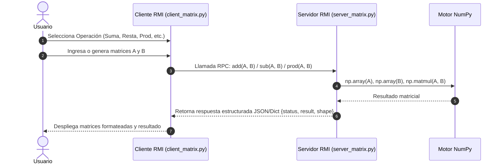
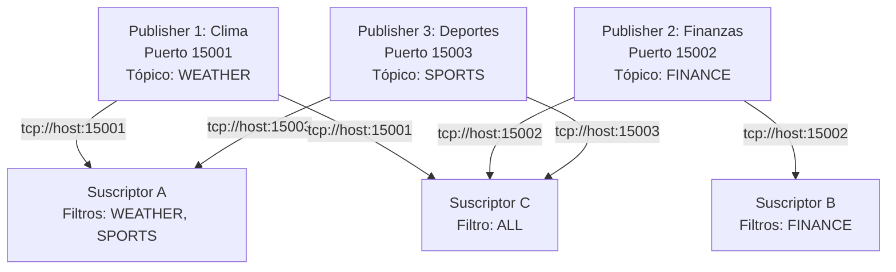
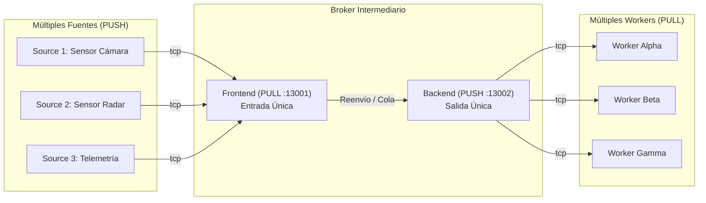

# INFORME DE LABORATORIO - WORKSHOP 2
## COMUNICACIÓN EN SISTEMAS DISTRIBUIDOS: MENSAJERÍA Y COLAS DE MENSAJES

**Institución:** Universidad Yachay Tech  
**Escuela:** School of Mathematical and Computational Sciences  
**Materia:** Distributed Systems  
**Semestre:** II - 2026  
**Profesor:** Prof. Francisco Hidrobo  
**Fecha:** 27 de Agosto de 2026  

---

## Resumen Ejecutivo

El presente informe detalla el diseño, implementación y evaluación experimental de tres modelos fundamentales de comunicación en sistemas distribuidos correspondientes a las actividades 2, 4 y 6 del Workshop 2:
1. **Parte 1 (Actividad 2):** Invocación de Métodos Remotos (RMI/XML-RPC) para un Gestor Distribuido de Matrices con aceleración de cómputo en **NumPy**.
2. **Parte 2 (Actividad 4):** Patrón Publicador-Suscriptor (PUB-SUB) con múltiples publicadores ofreciendo servicios heterogéneos y múltiples suscriptores con filtrado por tópicos en **ZeroMQ**.
3. **Parte 3 (Actividad 6):** Patrón Pipeline con Broker Intermediario (*Source $\to$ Broker $\to$ Worker*) con entrada y salida únicas en el broker para balanceo de carga y desacoplamiento en **ZeroMQ**.

---

## 1. PARTE 1 (Actividad 2): Distributed "Matrix Manager" (RMI / XML-RPC)

### 1.1. Arquitectura y Diseño

El patrón RMI (Remote Method Invocation) permite a un cliente invocar funciones que se ejecutan en un espacio de memoria o máquina remota como si fueran llamadas locales. En esta implementación se utilizó el protocolo XML-RPC (`xmlrpc.server` y `xmlrpc.client`) combinado con **NumPy** en el lado del servidor para cálculo numérico de alto rendimiento.



### 1.2. Métodos Expuestos en el Servidor
- `add(matrix_a, matrix_b)`: Suma elemento a elemento ($A + B$).
- `sub(matrix_a, matrix_b)`: Resta elemento a elemento ($A - B$).
- `prod(matrix_a, matrix_b)`: Multiplicación matricial / Producto punto ($A \cdot B$ o $A \times B$).
- `transpose(matrix_a)`: Cálculo de la transpuesta ($A^T$).
- `det(matrix_a)`: Cálculo del determinante para matrices cuadradas ($\det(A)$).

### 1.3. Código Fuente Principal

#### Servidor (`server_matrix.py`):
```python
from xmlrpc.server import SimpleXMLRPCServer, SimpleXMLRPCRequestHandler
import numpy as np

class RequestHandler(SimpleXMLRPCRequestHandler):
    rpc_paths = ('/RPC2',)

class MatrixManager:
    def add(self, matrix_a, matrix_b):
        arr_a, arr_b = np.array(matrix_a, dtype=float), np.array(matrix_b, dtype=float)
        result = np.add(arr_a, arr_b)
        return {"status": "OK", "operation": "add", "result": result.tolist(), "shape": list(result.shape)}

    def sub(self, matrix_a, matrix_b):
        arr_a, arr_b = np.array(matrix_a, dtype=float), np.array(matrix_b, dtype=float)
        result = np.subtract(arr_a, arr_b)
        return {"status": "OK", "operation": "sub", "result": result.tolist(), "shape": list(result.shape)}

    def prod(self, matrix_a, matrix_b):
        arr_a, arr_b = np.array(matrix_a, dtype=float), np.array(matrix_b, dtype=float)
        result = np.matmul(arr_a, arr_b)
        return {"status": "OK", "operation": "prod", "result": result.tolist(), "shape": list(result.shape)}
```

### 1.4. Evidencias de Ejecución y Resultados

```text
============================================================
 DISTRIBUTED MATRIX MANAGER - CLIENTE RMI
============================================================
--- Matriz A (dimensiones (2, 3)) ---
  [     1.00	    2.00	    3.00 ]
  [     4.00	    5.00	    6.00 ]

--- Matriz B (dimensiones (3, 2)) ---
  [     7.00	    8.00 ]
  [     9.00	    1.00 ]
  [     2.00	    3.00 ]

--- RESULTADO: A @ B (dimensiones (2, 2)) ---
  [    31.00	   19.00 ]
  [    85.00	   55.00 ]
```

---

## 2. PARTE 2 (Actividad 4): Multi-Publisher y Multi-Subscriber (ZeroMQ PUB-SUB)

### 2.1. Arquitectura y Diseño

En el modelo Publicador-Suscriptor, los publicadores emiten mensajes a través de canales de tópicos sin conocer quiénes son los suscriptores (desacoplamiento espacial y temporal). En ZeroMQ, un único socket `zmq.SUB` tiene la capacidad de conectarse a múltiples endpoints (`connect` múltiple) y aplicar múltiples filtros de suscripción por prefijo de cadena (`zmq.SUBSCRIBE`).



### 2.2. Implementación de Servicios
1. **Servicio Meteorológico (`pub_weather.py` - Puerto 15001):** Transmite condiciones de ciudades (Quito, Ibarra, Cuenca, Guayaquil) con temperatura y humedad.
2. **Servicio Financiero (`pub_finance.py` - Puerto 15002):** Emite cotizaciones de divisas, criptomonedas y acciones (BTC, USD/EUR, AAPL, NVDA).
3. **Servicio Deportivo (`pub_sports.py` - Puerto 15003):** Publica eventos en vivo de LigaPro, Champions League, Premier League y NBA.

### 2.3. Código Clave de Multi-Suscripción (`subscriber_multi.py`)
```python
import zmq

context = zmq.Context()
sub_socket = context.socket(zmq.SUB)

# Conexión a múltiples publicadores
endpoints = ["tcp://localhost:15001", "tcp://localhost:15002", "tcp://localhost:15003"]
for ep in endpoints:
    sub_socket.connect(ep)

# Filtrado selectivo de tópicos
topics = ["WEATHER", "SPORTS"]
for t in topics:
    sub_socket.setsockopt_string(zmq.SUBSCRIBE, t)

while True:
    msg = sub_socket.recv_string()
    print(f"[RECIBIDO] {msg}")
```

### 2.4. Evidencias de Ejecución y Resultados

```text
[Sub-Clima-Deportes] [RECIBIDO #1] (WEATHER) [10:15:32] #1 en Quito: 19.2°C, Humedad 65%, Soleado
[Sub-Clima-Deportes] [RECIBIDO #2] (SPORTS) [10:15:33] #1 [LigaPro] LDU Quito 1 - 0 Barcelona SC | Gol min 34'
[Sub-Trader] [RECIBIDO #1] (FINANCE) [10:15:34] #1 Cotización BTC/USD: $64850.0 (+1.85%)
```

---

## 3. PARTE 3 (Actividad 6): Pipeline con Broker Intermediario (Source $\to$ Broker $\to$ Worker)

### 3.1. Arquitectura y Diseño

El patrón de Pipeline tradicional conecta directamente una fuente a múltiples trabajadores. Sin embargo, cuando existen **múltiples fuentes generadoras** y **múltiples trabajadores**, se requiere un componente **Broker Intermediario** con:
- **Frontend (PULL en puerto 13001):** Entrada única que consolida las tareas provenientes de $N$ fuentes concurrentes.
- **Backend (PUSH en puerto 13002):** Salida única que distribuye y balancea la carga equitativamente (*Fair Queueing / Round Robin*) entre $M$ trabajadores concurrentes.



### 3.2. Implementación del Broker (`broker.py`)
```python
import zmq

context = zmq.Context()
frontend = context.socket(zmq.PULL)
frontend.bind("tcp://*:13001")

backend = context.socket(zmq.PUSH)
backend.bind("tcp://*:13002")

while True:
    task_bytes = frontend.recv()
    backend.send(task_bytes)
```

### 3.3. Evidencias de Ejecución y Resultados

```text
[BROKER] Tarea #1 recibida de [Sensor-Camara] (TaskID: 1, Carga: 45 ms) -> Reenviando a Workers...
[BROKER] Tarea #2 recibida de [Sensor-Radar]  (TaskID: 1, Carga: 20 ms) -> Reenviando a Workers...
[Worker-Alpha] RECIBIDO: Tarea #1 de [Sensor-Camara] | Carga: 45 u -> COMPLETADO
[Worker-Beta]  RECIBIDO: Tarea #1 de [Sensor-Radar]  | Carga: 20 u -> COMPLETADO
```

---

## 4. Conclusiones y Comparativa de Patrones

| Patrón | Comunicación | Acoplamiento | Caso de Uso Óptimo |
| :--- | :--- | :--- | :--- |
| **RMI / XML-RPC** | Síncrona (Request-Reply) | Fuerte (Cliente conoce interfaz del servidor) | Cómputo matemático intensivo, consultas bajo demanda. |
| **Pub-Sub (ZeroMQ)** | Asíncrona (1 a N, N a M) | Débil (Desacoplado en tiempo y espacio) | Distribución de eventos, noticias, sensores IoT, feeds financieros. |
| **Pipeline con Broker** | Asíncrona (N a 1 a M) | Medio (Broker como coordinador de cola) | Procesamiento paralelo de trabajos pesados, balanceo de carga. |
